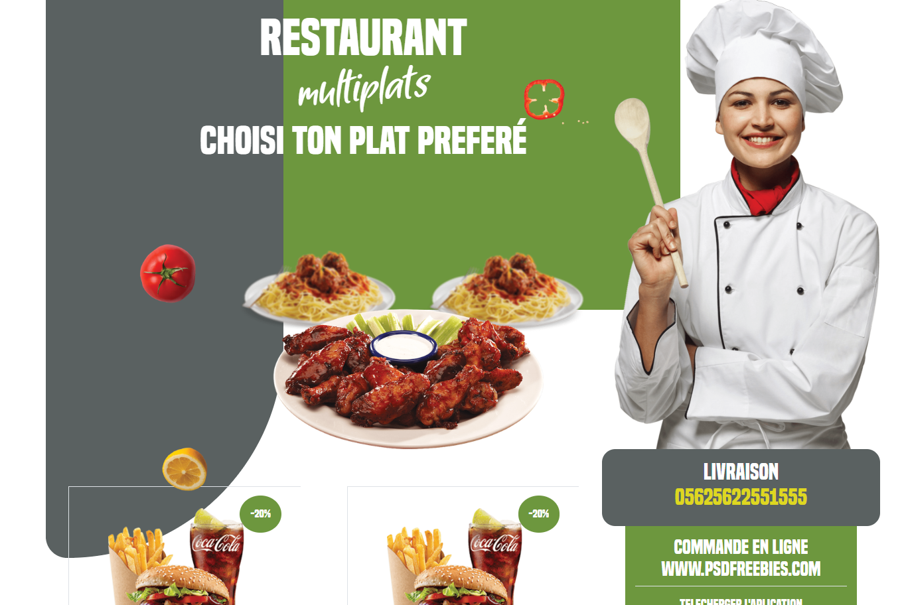

# flyer-resto
Maquette réalisé en REACT et Bootstrap depuis un flyer du site WWW.PSDFREEBIES.COM
travail realisé:
-superposition d'image
-mise an forme div par css
-ajustement position image
-integration police
-ajustement affichage en mode mobile 

---------le poids des images ne sont pas optimisé------
voir le site sur surge: http://thoughtful-farmer.surge.sh/

